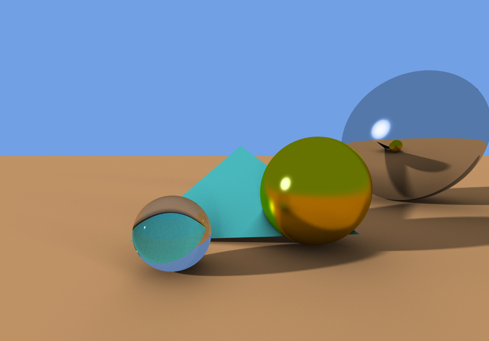

# Ray Tracer



A ray tracer based off of Kevin Suffern's "Ray Tracing from the Ground Up". The image above displays transparent, glossy reflective, and mirror reflective materials. It was rendered with 256 multi-jittered samples.

## Features

- Geometries: sphere, plane, triangle, torus (centered at the origin), axis-aligned box
- Sampling: multi-jittered, regular
- Cameras: pinhole, fisheye
- Shading: diffuse, glossy specular, mirror reflections, glossy reflections, ambient occlusion, simple transparency
- Lighting: ambient, point, directional, shadows
- Parallelization
  - Benchmark (4 cores, 1 regular sample per pixel):
    - Running without parallelization - Render time: 3.45462 seconds
    - Running 4 threads in parallel - Render time: 1.42352 seconds

## Requirements

- Linux or Windows
- C++ compiler (for Linux: GNU C++ 7.4+)
- OpenGL 4.5+
- CMake 3.12+
- Python 3.X
- Git

## How to Run

```bash
cmake CMakeLists.txt
make raytracer
./raytracer
```
